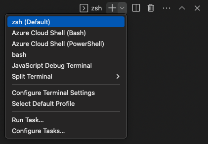

# btb hooks

## Mail Goal

#### The main goal of this script [prepare-commit-msg.sh](./prepare-commit-msg.sh) is to automatically change the git commit message if the current branch is related to a jira ticket, if so, the jira ticket related commits will automatically increased.

---

## Installation && Integration

#### This script rely on few things that are mandatory.

1. Git version is above 2.9.0.
   ```sh
       git --version
           # git version 2.32.1
   ```
2. Git bash installed on each machine.

- 1. If you are not sure git bash is installed, you can do one of two things
     Open Visual Studio code -> Terminal ->  </img>
     - If you see bash option, you are good to go.

- 2. Open any folder on your windows. right click ->
      </img>
     - If you see 'git bash here', you are good to go.

3.  Do not remove or change location of this script.

    - The path of the script is where you have cloned this repository to.

4.  Set git config global parameter of the path of the script
    ```sh
    git config --global core.hooksPath repo-location/hooks

    ```

 </img>

## Validations

In order to check that this script is valid, follow these steps

1.  Create a branch from a jira issue, the branch name must have the issue key in it. (ABC-1234-add-new-feature)
2.  go to your local workspace,
3.  git fetch
4.  git checkout your_branch_name
5.  make some changes on your local branch and commit them.

go to gitlab and check for your commit message or type :

```sh
  git log -1 --oneline
```
